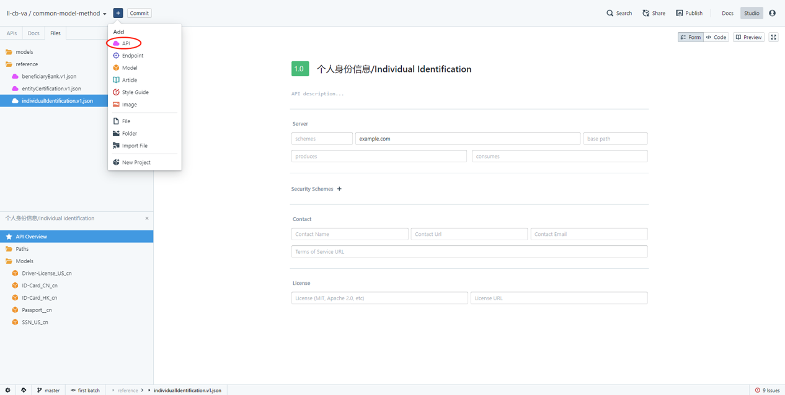

# Tutorial

## Preparations
  1. Github account - [github](https://github.com)
    - Team github account cb-va-github@lianlianpay.com
  2. Stoplight accont - [stoplight](https://stoplight.io/p/signup)
  3. Link your github account with stoplight account, you can stil use stoplight without a git, but everything you created will be maintained locally and you cannot publish the doc

## Create a new project
  1. start a new github repository, private project is highly recommanded
    -[How to use github](https://help.github.com/en/github/getting-started-with-github)
  2. get repository clone url from your github account
  3. switch to your stoplight account, click + button on upper left coroner and choose new project, ignore this step if you are already on the project lunching page
    
  4. from stoplight project lunching page, paste your repository clone url into Git URL input box, and click clone
    

## Working with an existing project 
  1. If the project is private, ask the project owner to add you as one of the collaborators
    - [How to add collaborators](https://help.github.com/en/github/getting-started-with-github)
  From repository page, click settings, then click manage access, "Invite a collaborator"
  2. Login to your onw github and accept the invitation
  3. Copy the project repository url and paste into the Git URL input box on project lunching page

<!-- theme: warning -->
> ### Important
> Better to start from a git repository, otherwise you will not able to publish 
>
> Company Project should be started from company github account and invit collaborators to make contribution, and do not >upload programming code into github
>

## REST API -- [Rest Wiki](https://en.wikipedia.org/wiki/Representational_state_transfer)
    1. Representational state transfer is a software architectural style that defines a set of constraints to be used for creating Web services. Equivalate to SOAP.
    2. Client-server architecture
    3. Statelessness
    4. Cacheability
    5. Layered system
    6. Code on demand
    7. Uniform interface
In a short, REST API is a set of operations on their resource (?? & ??). Keep this in mind, the biggest difference between REST & SOAP is Rest API methods all around resources, but SOAP is originated from business process. 
HTTP Methods -- GET POST PUT PATCH DELETE ...

<!-- theme: info -->
> ### Example:
>
> ##### GET 
>   - Get Profile ***/baseURL/resources/`{resource_id}`***
>   - Get Profile List ***/baseURL/resources***
> ##### POST 
>   - Create Profile ***/baseURL/resources***
> ##### PUT 
>   - Confirm Onboard ***/baseURL/resources/{resource_id}***
>

## Stopligt UI & Terminology
  1. Project Actions: Contains actions to help you add new assets to your project, such as APIs, models, articles, etc.
  2. Project Trees: The project sidebar tree tabs provide different views into your project. Switch between a view of API related assets, docs, and all of the files/folders in your project.
  3. Primary Panel: You can switch which mode is shown on the primary panel by clicking the mode selector in the top right. You can show the form editor, docs view, or code editor here. You can also click the expand button to go full screen with the panel.
  4. Secondary Panel: The secondary panel allows you to view two different modes side by side. In this screenshot, we've configured Studio to show the form editor in the primary panel, and the code editor in the secondary panel.
  5. Settings & Login: Most of Studio can be used offline & while logged out. A few features, such as git, require you to login.
  6. Git: If the project you are working with is connected to a Git repository, you can quickly switch branches by clicking on these buttons.
  7. Crumbs: These crumbs give you an at a glance look at where you are in your project.
  8. Spectral & Prism: Click these buttons to open the validations and mocking panels.
  9. API - A set of paths, models, etc
  10.Paths - API methods, contains ???? eg
  11.Models - API resources a set of endpoints
  12.Reference - A set of methods & resources (?? & ??) can be referenced by a project(a document), for example document, webhook and event can be used cross different documents. 

## Create a new reference - API
  1. Staring from project page, click + button on upper left coroner and choose API
    
  2. Enter API name, and select spec/format by clicking 'Show Advance'. OpenAPI v2 and json are the ones you should select, keep in mind this is very important!!! Reason is OpenAPI v3 is not editable from releasing tool and json is easier to process when compared with yaml 
  3. After creation, you will have a page like this ...
    
  4. One API has three components - API Overview, Paths, Models (?? & ??). Remember the relation between Path & Model.
  5. Components are listed at the left coroner of your page. 

## Define a new Model
  1. Right click on Models or add from "Project Actions" ( + on upper left)
  2. Enter the model name and enter, model name suggestion ***[name(camelcase)]_[language(cn/en)]***
  3. From the new model page, there are 4 things you should know, "no tags", "Form", "Code" and "Preview"
  4. "no tages" is used to create a tag for this model, after tagging, model will be displayed under the tag, no necessary in our scenario
  5. "Form" where you edit the description & attribute(s) of the model
  6. "Code" sourcing code behind "Form"
  7. "Preview" gives an instant view of what you created without publish

## Define a new Path
  1. Right click on Paths or add from "Project Actions"
  2. Enter the path of your endpoint, e.g. /collection/v1/users (/product/version/resource)
  3. From endpoint page, choose the actual HTTP method you want to create - GET, POST, PUT, PATCH, DELETE, HEAD, OPTIONS, TRACE
  4. give a unique operation id, very important!
  5. Create request body for POST, PUT, PATCH
  6. GET query paramater
  7. Create response body
  8. Add security requirements, such as authorization header and signature header

## Define a schema
  1. Under the schema tab of a model or a path, click object will give you the options of your schema, which is allOf/oneOf/anyOf the followings: object, array, string, number, integer, bollean, null, $ref(reference to another asset, can be a link, a model, an img)
  2. + button allowes you to add a new element to your schema, same to object, you can still choose different type of your element
  3. in the end of each element row, there are four btns useful, additional properties, required or not, description and delete row
  4. additional properties - can define enum values, actual data format, default value, example, pattern and size limitation. Value entered will displayed as tooltip

## How to design models & paths

#### Model example

    Profile
      |
      |----KYC
      |     |
      |     |---Name
      |     |---Address
      |     |---UBOs
      |     `---LegRep
      |
      |----Accounts
      `----Bills

#### Path example
    [domain][base-url][resource][:id]
    1. Get profiles of a merchant - global-api.lianlianpay.com/example/v1/profiles
    2. Get a single profile - global-api.lianlianpay.com/example/v1/profiles/{profileId}
    3. Get the KYC of a profile - global-api.lianlianpay.com/example/v1/profiles/{profileId}/kyc
    4. Get the UBOs of a profile - global-api.lianlianpay.com/example/v1/profiles/{profileId}/kyc/ubos
    5. Get all the bills of a profile - global-api.lianlianpay.com/example/v1/profiles/{profileId}/bills
    6. Get a bill of a profile - global-api.lianlianpay.com/example/v1/profiles/{profileId}/bills/{billId}

    How about post, put, delete?

## Tips:
  1. Do not use a, b, c... 1, 2, 3... to control display order of endpoints and models. Order is controled by the actual code order in the json file. I know this is stupid, but currently do as my suggestion.
  2. Element order in schema is also controled by actual code order in json file, adjust from there if you want to have a different order
  3. Give one common tag to those endpoints that you want to display together, no need to give a tag to models
  4. If you are trying to create a common component, create one API contains all models and paths. Means all content in one file
  5. If working together, make sure to pull the latest before start and commit/push when you finished. Better to work on your own branch. 

